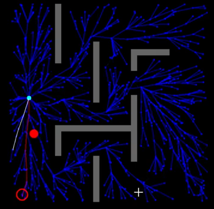

# Path Planning: implementing RT-RRT* algo for real-time obstacle avoidance

*Original paper:*
Naderi, K., Rajamäki, J., & Hämäläinen, P. (2015b). RT-RRT*: a real-time path planning algorithm based on RRT*. Proceedings of the 8th ACM SIGGRAPH Conference on Motion in Games. https://dl.acm.org/doi/10.1145/2822013.2822036 

video demo:

